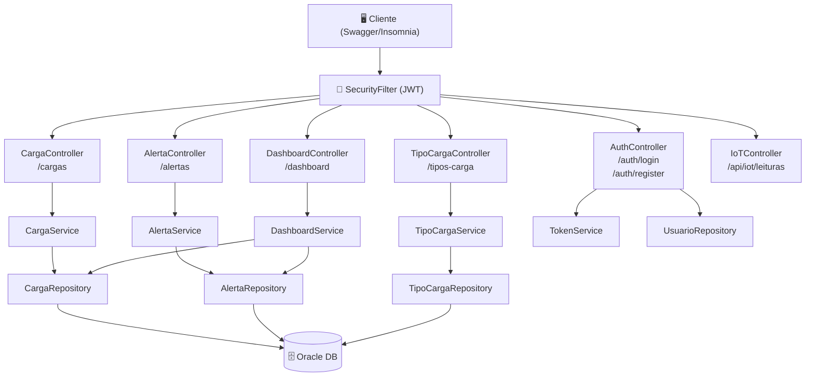
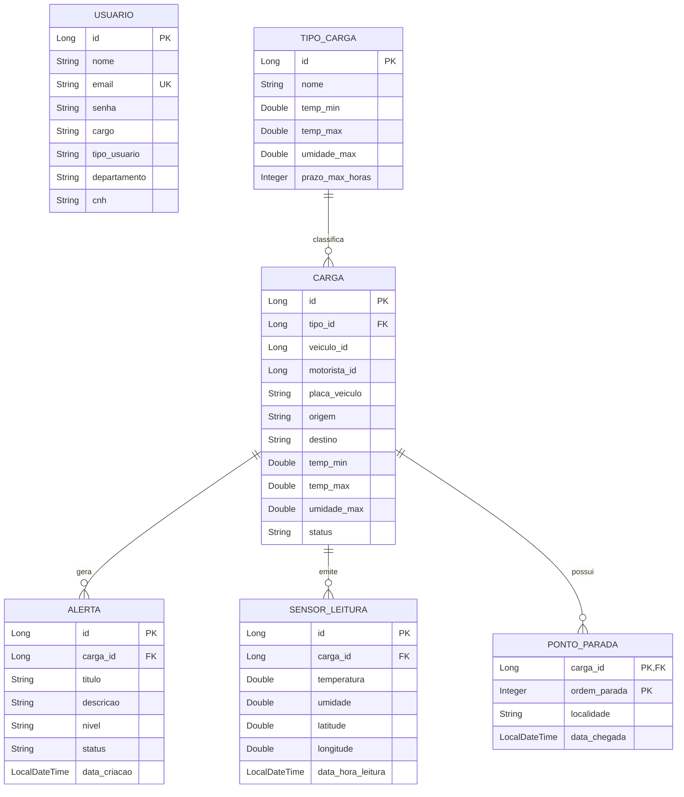

<div align="center">


# 🛰️ Orbifreight API

### Plataforma Inteligente de Monitoramento de Cargas em Trânsito

> API RESTful desenvolvida em Java com Spring Boot para a **Global Solution — Java Advanced | FIAP**  
> Monitoramento em tempo real de temperatura, umidade e localização de cargas sensíveis via IoT

---

</div>

## 🔗 Links Oficiais do Projeto

| Recurso | Link |
|---|---|
| 🚀 **Deploy (API em produção)** | [https://orbifreight-bud3csaaadddfxdq.eastus-01.azurewebsites.net](https://orbifreight-bud3csaaadddfxdq.eastus-01.azurewebsites.net) |
| 📖 **Documentação Swagger/OpenAPI** | [https://orbifreight-bud3csaaadddfxdq.eastus-01.azurewebsites.net/swagger-ui/index.html](https://orbifreight-bud3csaaadddfxdq.eastus-01.azurewebsites.net/swagger-ui/index.html) |
| 🎬 **Vídeo Pitch (3 minutos)** | [https://youtu.be/lgvnZS5-yeg](https://youtu.be/lgvnZS5-yeg) |
| 🎥 **Vídeo de Apresentação (10 minutos)** | [https://youtu.be/-CYGdHebzt8?si=DAfZRWNAL8H0eaQq](https://youtu.be/-CYGdHebzt8?si=DAfZRWNAL8H0eaQq) |
| 💻 **Repositório GitHub** | [https://github.com/gabrielalandim/orbifreight-api](https://github.com/gabrielalandim/orbifreight-api) |

---

## 📋 Sumário

- [Sobre o Projeto](#-sobre-o-projeto)
- [Arquitetura](#-arquitetura-do-sistema)
- [Tecnologias](#-tecnologias-utilizadas)
- [Modelagem de Dados](#-modelagem-de-dados-der)
- [Endpoints da API](#-endpoints-da-api)
- [Segurança — JWT](#-segurança--autenticação-jwt)
- [Como Executar Localmente](#-como-executar-localmente)
- [Integrantes](#-integrantes)

---

## 🎯 Sobre o Projeto

O **Orbifreight** é uma API REST para gerenciamento inteligente de cargas sensíveis em transporte (farmacêuticos, alimentos perecíveis, cargas críticas). A solução endereça o problema de **perda de carga por falha de monitoramento** durante o transporte, oferecendo:

- **Cadastro e rastreamento** de cargas com parâmetros de temperatura e umidade permitidos
- **Alertas automáticos** categorizados por nível de criticidade (BAIXO → CRÍTICO)
- **Telemetria IoT** — endpoint dedicado para recebimento de leituras de sensores embarcados
- **Dashboard analítico** com contagem de cargas ativas e alertas abertos em tempo real
- **Herança de usuários** com papéis distintos: Gestor (ADMIN) e Motorista (USER)

---

## 🏗️ Arquitetura do Sistema

A API segue uma arquitetura em **camadas desacopladas**, respeitando o princípio da responsabilidade única:

```
┌─────────────────────────────────────────────────────────┐
│                      CLIENT / SWAGGER                    │
└────────────────────────┬────────────────────────────────┘
                         │ HTTP Request + Bearer Token
┌────────────────────────▼────────────────────────────────┐
│              SPRING SECURITY + JWT FILTER                │
│         (SecurityFilter → TokenService → Valida)        │
└────────────────────────┬────────────────────────────────┘
                         │ Requisição autorizada
┌────────────────────────▼────────────────────────────────┐
│                   CONTROLLER LAYER                       │
│   AuthController │ CargaController │ AlertaController   │
│   TipoCargaController │ DashboardController │ IoTCtrl   │
│              (HATEOAS links em todas respostas)         │
└────────────────────────┬────────────────────────────────┘
                         │ Chama Service + valida DTOs
┌────────────────────────▼────────────────────────────────┐
│                    SERVICE LAYER                         │
│   CargaService │ AlertaService │ TipoCargaService        │
│        DashboardService │ AuthorizationService           │
│           (lógica de negócio + @Transactional)          │
└────────────────────────┬────────────────────────────────┘
                         │ JPA / ORM
┌────────────────────────▼────────────────────────────────┐
│                  REPOSITORY LAYER                        │
│        JpaRepository estendido por cada entidade        │
└────────────────────────┬────────────────────────────────┘
                         │
┌────────────────────────▼────────────────────────────────┐
│                 ORACLE DATABASE (Azure)                  │
└─────────────────────────────────────────────────────────┘
```

### Diagrama de Arquitetura (Mermaid)



---

## 🛠️ Tecnologias Utilizadas

| Categoria | Tecnologia | Versão |
|---|---|---|
| Linguagem | Java | 17 |
| Framework Principal | Spring Boot | 3.3.5 |
| Persistência | Spring Data JPA + Hibernate | 3.3.5 |
| Segurança | Spring Security + JWT (Auth0) | 4.4.0 |
| Documentação | SpringDoc OpenAPI / Swagger UI | 2.6.0 |
| Banco de Dados (Prod) | Oracle Database | 19c+ |
| Banco de Dados (Dev/Test) | H2 in-memory | — |
| Build | Maven | 3.9+ |
| Produtividade | Lombok + DevTools | — |
| HATEOAS | Spring HATEOAS | — |
| Cloud | Microsoft Azure App Service | — |
| Comunicação HTTP | OpenFeign (Spring Cloud) | — |
| Validação | Spring Validation (Jakarta) | — |

---

## 🗃️ Modelagem de Dados (DER)

### Diagrama Entidade-Relacionamento



### Destaques de Modelagem Avançada

| Recurso | Implementação | Localização |
|---|---|---|
| **Herança (SINGLE_TABLE)** | `Usuario` → `Gestor` (ADMIN) e `Motorista` (USER) | `models/Usuario.java` |
| **Chave Composta** | `PontoParadaId` com `@EmbeddedId` | `models/PontoParadaId.java` |
| **Embedded** | `CoordenadaGPS` (latitude/longitude) dentro de `SensorLeitura` | `models/CoordenadaGPS.java` |
| **Múltiplos relacionamentos** | `@OneToMany`, `@ManyToOne`, `@MapsId` | Todas as entidades |

---

## 📡 Endpoints da API

### 🔑 Autenticação — `/auth`
| Método | Endpoint | Descrição | Auth? |
|---|---|---|---|
| POST | `/auth/register` | Registra novo usuário | ❌ |
| POST | `/auth/login` | Login e retorna token JWT | ❌ |

### 📦 Cargas — `/cargas`
| Método | Endpoint | Descrição | Auth? |
|---|---|---|---|
| GET | `/cargas` | Lista todas as cargas | ✅ |
| GET | `/cargas/{id}` | Busca carga por ID | ✅ |
| POST | `/cargas` | Cria nova carga | ✅ |
| PUT | `/cargas/{id}` | Atualiza carga existente | ✅ |
| DELETE | `/cargas/{id}` | Remove carga | ✅ |

### 🚨 Alertas — `/alertas`
| Método | Endpoint | Descrição | Auth? |
|---|---|---|---|
| GET | `/alertas` | Lista todos os alertas | ✅ |
| GET | `/alertas/{id}` | Busca alerta por ID | ✅ |
| POST | `/alertas` | Cria novo alerta | ✅ |
| PUT | `/alertas/{id}` | Atualiza alerta | ✅ |
| DELETE | `/alertas/{id}` | Remove alerta | ✅ |

### 🏷️ Tipos de Carga — `/tipos-carga`
| Método | Endpoint | Descrição | Auth? |
|---|---|---|---|
| GET | `/tipos-carga` | Lista tipos de carga | ✅ |
| GET | `/tipos-carga/{id}` | Busca tipo por ID | ✅ |
| POST | `/tipos-carga` | Cria tipo de carga | ✅ |
| PUT | `/tipos-carga/{id}` | Atualiza tipo de carga | ✅ |
| DELETE | `/tipos-carga/{id}` | Remove tipo de carga | ✅ |

### 📊 Dashboard — `/dashboard`
| Método | Endpoint | Descrição | Auth? |
|---|---|---|---|
| GET | `/dashboard` | Estatísticas gerais (cargas, alertas) | ✅ |

### 🌡️ IoT — `/api/iot`
| Método | Endpoint | Descrição | Auth? |
|---|---|---|---|
| POST | `/api/iot/leituras` | Recebe telemetria de sensor embarcado | ✅ |

> Todos os endpoints protegidos retornam links HATEOAS para navegação da API.

---

## 🔐 Segurança — Autenticação JWT

O fluxo de autenticação segue o padrão **Stateless JWT**:

```
1. POST /auth/register  → cadastra usuário com senha encriptada (BCrypt)
2. POST /auth/login     → retorna { token, id, nome }
3. Bearer {token}       → header Authorization em todas as requisições protegidas
4. SecurityFilter       → intercepta, valida e injeta o usuário no SecurityContext
```

**Exemplo de fluxo no Swagger:**
1. Execute `POST /auth/login` com suas credenciais
2. Copie o valor do campo `token` da resposta
3. Clique em **Authorize 🔓** no topo do Swagger
4. Cole `Bearer SEU_TOKEN_AQUI` e confirme

---

## ▶️ Como Executar Localmente

### Pré-requisitos
- Java 17+
- Maven 3.9+
- (Opcional) Oracle Database — o projeto usa H2 por padrão em perfil local

### Passo a Passo

```bash
# 1. Clone o repositório
git clone https://github.com/gabrielalandim/orbifreight-api.git
cd orbifreight-api

# 2. Execute com Maven (usa H2 in-memory por padrão)
./mvnw spring-boot:run

# 3. Acesse a documentação
# http://localhost:8080/swagger-ui/index.html
```

### Variáveis de Ambiente (Produção Oracle)

```properties
SPRING_DATASOURCE_URL=jdbc:oracle:thin:@<host>:1521/<service>
SPRING_DATASOURCE_USERNAME=seu_usuario
SPRING_DATASOURCE_PASSWORD=sua_senha
JWT_SECRET=sua_chave_secreta_jwt
```

### Testando a API

**1. Registrar usuário:**
```json
POST /auth/register
{
  "nome": "Gestor Teste",
  "email": "gestor@orbifreight.com",
  "senha": "senha123",
  "cargo": "ADMIN"
}
```

**2. Fazer login e obter token:**
```json
POST /auth/login
{
  "email": "gestor@orbifreight.com",
  "senha": "senha123"
}
```

**3. Criar tipo de carga (com Bearer token):**
```json
POST /tipos-carga
Authorization: Bearer <token>
{
  "nome": "Farmacêutico Refrigerado",
  "tempMin": 2.0,
  "tempMax": 8.0,
  "umidadeMax": 60.0,
  "prazoMaxHoras": 48
}
```

---

## 👩‍💻 Integrantes

| Nome | RM | Turma  |
|---|---|--------|
| Maria Gabriela Landim Severo | RM565146 | 2TDSR  |
| Eduarda Weiss Ventura | RM564434 | 2TDPX  |
| Samara Porto Souza | RM559072 | 2TDSR  |
| Lucas Nunes Soares | RM566503 | 2TDSPX |
| Camilly Vitoria Pereira Maciel | RM566520 | 2TDSPX |

---

<div align="center">

**Global Solution 2026 — Java Advanced | FIAP**

</div>
