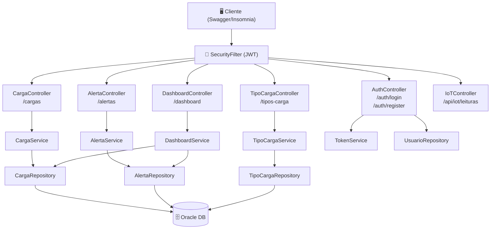
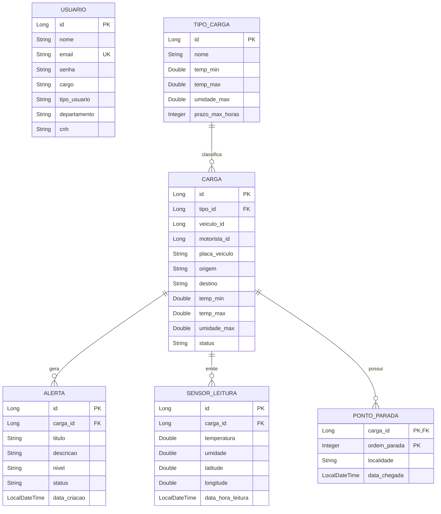

[](https://openjdk.org/projects/jdk/17/)
[](https://spring.io/projects/spring-boot)
[](https://spring.io/projects/spring-security)
[](https://www.oracle.com/database/)
[](https://azure.microsoft.com/)
[](https://swagger.io/)

# 🛰️ Orbifreight API

### Plataforma Inteligente de Monitoramento de Cargas em Trânsito

> API RESTful desenvolvida em Java com Spring Boot para a **Global Solution — Java Advanced | FIAP**  
> Monitoramento em tempo real de temperatura, umidade e localização de cargas sensíveis via IoT

---

## 🔗 Links Oficiais do Projeto

| Recurso | Link |
|---|---|
| 🚀 **Deploy (API em produção)** | https://orbifreight-bud3csaaadddfxdq.eastus-01.azurewebsites.net |
| 📖 **Documentação da API (Swagger/OpenAPI)** | https://orbifreight-bud3csaaadddfxdq.eastus-01.azurewebsites.net/swagger-ui/index.html |
| 🎬 **Vídeo Pitch (3 minutos)** | https://youtu.be/lgvnZS5-yeg |
| 🎥 **Vídeo de Apresentação (10 minutos)** | https://youtu.be/-CYGdHebzt8?si=DAfZRWNAL8H0eaQq |
| 💻 **Repositório GitHub** | https://github.com/gabrielalandim/orbifreight-api |

---

## 📋 Sumário

- [Sobre o Projeto](#-sobre-o-projeto)
- [Arquitetura](#️-arquitetura-do-sistema)
- [Tecnologias](#️-tecnologias-utilizadas)
- [Modelagem de Dados](#️-modelagem-de-dados-der)
- [Endpoints da API](#-endpoints-da-api)
- [HTTP Status Codes](#-http-status-codes)
- [Java Records e DTOs](#-java-records-e-dtos)
- [Segurança — JWT](#-segurança--autenticação-jwt)
- [Configuração de CORS](#-configuração-de-cors)
- [Documentação da API (Swagger)](#-documentação-da-api-swagger)
- [Como Executar Localmente](#️-como-executar-localmente)
- [Integrantes](#-integrantes)

---

## 🎯 Sobre o Projeto

O **Orbifreight** é uma API REST para gerenciamento inteligente de cargas sensíveis em transporte (farmacêuticos, alimentos perecíveis, cargas críticas). A solução endereça o problema de **perda de carga por falha de monitoramento** durante o transporte, oferecendo:

- **Cadastro e rastreamento** de cargas com parâmetros de temperatura e umidade permitidos
- **Alertas automáticos** categorizados por nível de criticidade (BAIXO → CRÍTICO)
- **Telemetria IoT** — endpoint dedicado para recebimento de leituras de sensores embarcados
- **Dashboard analítico** com contagem de cargas ativas e alertas abertos em tempo real
- **Herança de usuários** com papéis distintos: Gestor (ADMIN) e Motorista (USER)

---

## 🏗️ Arquitetura do Sistema

A API segue uma arquitetura em **camadas desacopladas**, respeitando o princípio da responsabilidade única:

```
┌─────────────────────────────────────────────────────────┐
│                      CLIENT / SWAGGER                    │
└────────────────────────┬────────────────────────────────┘
                         │ HTTP Request + Bearer Token
┌────────────────────────▼────────────────────────────────┐
│              SPRING SECURITY + JWT FILTER                │
│         (SecurityFilter → TokenService → Valida)        │
└────────────────────────┬────────────────────────────────┘
                         │ Requisição autorizada
┌────────────────────────▼────────────────────────────────┐
│                   CONTROLLER LAYER                       │
│   AuthController │ CargaController │ AlertaController   │
│   TipoCargaController │ DashboardController │ IoTCtrl   │
│              (HATEOAS links em todas respostas)         │
└────────────────────────┬────────────────────────────────┘
                         │ Chama Service + valida DTOs
┌────────────────────────▼────────────────────────────────┐
│                    SERVICE LAYER                         │
│   CargaService │ AlertaService │ TipoCargaService        │
│        DashboardService │ AuthorizationService           │
│           (lógica de negócio + @Transactional)          │
└────────────────────────┬────────────────────────────────┘
                         │ JPA / ORM
┌────────────────────────▼────────────────────────────────┐
│                  REPOSITORY LAYER                        │
│        JpaRepository estendido por cada entidade        │
└────────────────────────┬────────────────────────────────┘
                         │
┌────────────────────────▼────────────────────────────────┐
│                 ORACLE DATABASE (Azure)                  │
└─────────────────────────────────────────────────────────┘
```

### Diagrama de Arquitetura (Mermaid)



---

## 🛠️ Tecnologias Utilizadas

| Categoria | Tecnologia | Versão |
|---|---|---|
| Linguagem | Java | 17 |
| Framework Principal | Spring Boot | 3.3.5 |
| Persistência | Spring Data JPA + Hibernate | 3.3.5 |
| Segurança | Spring Security | 6.3.4 |
| Autenticação | JWT (Auth0 java-jwt) | 4.4.0 |
| Documentação | SpringDoc OpenAPI / Swagger UI | 2.6.0 |
| Banco de Dados (Prod) | Oracle Database | 19c+ |
| Banco de Dados (Dev/Test) | H2 in-memory | 2.2.224 |
| Build | Maven | 3.9+ |
| Produtividade | Lombok | 1.18.34 |
| Produtividade | Spring Boot DevTools | 3.3.5 |
| HATEOAS | Spring HATEOAS | 2.3.2 |
| Cloud | Microsoft Azure App Service | — |
| Comunicação HTTP | OpenFeign (Spring Cloud) | 4.1.3 |
| Validação | Spring Validation (Jakarta) | 3.3.5 |

---

## 🗃️ Modelagem de Dados (DER)

### Diagrama Entidade-Relacionamento



### Destaques de Modelagem Avançada

| Recurso | Implementação | Localização |
|---|---|---|
| **Herança (SINGLE_TABLE)** | `Usuario` → `Gestor` (ADMIN) e `Motorista` (USER) | `models/Usuario.java` |
| **Chave Composta** | `PontoParadaId` com `@EmbeddedId` | `models/PontoParadaId.java` |
| **Embedded** | `CoordenadaGPS` (latitude/longitude) dentro de `SensorLeitura` | `models/CoordenadaGPS.java` |
| **Múltiplos relacionamentos** | `@OneToMany`, `@ManyToOne`, `@MapsId` | Todas as entidades |

---

## 📡 Endpoints da API

### 🔑 Autenticação — `/auth`

| Método | Endpoint | Descrição | Auth? | Status |
|---|---|---|---|---|
| POST | `/auth/register` | Registra novo usuário | ❌ | `201 Created` |
| POST | `/auth/login` | Login e retorna token JWT | ❌ | `200 OK` |

### 📦 Cargas — `/cargas`

| Método | Endpoint | Descrição | Auth? | Status |
|---|---|---|---|---|
| GET | `/cargas` | Lista todas as cargas | ✅ | `200 OK` |
| GET | `/cargas/{id}` | Busca carga por ID | ✅ | `200 OK` / `404 Not Found` |
| POST | `/cargas` | Cria nova carga | ✅ | `201 Created` |
| PUT | `/cargas/{id}` | Atualiza carga existente | ✅ | `200 OK` / `404 Not Found` |
| DELETE | `/cargas/{id}` | Remove carga | ✅ | `204 No Content` / `404 Not Found` |

### 🚨 Alertas — `/alertas`

| Método | Endpoint | Descrição | Auth? | Status |
|---|---|---|---|---|
| GET | `/alertas` | Lista todos os alertas | ✅ | `200 OK` |
| GET | `/alertas/{id}` | Busca alerta por ID | ✅ | `200 OK` / `404 Not Found` |
| POST | `/alertas` | Cria novo alerta | ✅ | `201 Created` |
| PUT | `/alertas/{id}` | Atualiza alerta | ✅ | `200 OK` / `404 Not Found` |
| DELETE | `/alertas/{id}` | Remove alerta | ✅ | `204 No Content` / `404 Not Found` |

### 🏷️ Tipos de Carga — `/tipos-carga`

| Método | Endpoint | Descrição | Auth? | Status |
|---|---|---|---|---|
| GET | `/tipos-carga` | Lista tipos de carga | ✅ | `200 OK` |
| GET | `/tipos-carga/{id}` | Busca tipo por ID | ✅ | `200 OK` / `404 Not Found` |
| POST | `/tipos-carga` | Cria tipo de carga | ✅ | `201 Created` |
| PUT | `/tipos-carga/{id}` | Atualiza tipo de carga | ✅ | `200 OK` / `404 Not Found` |
| DELETE | `/tipos-carga/{id}` | Remove tipo de carga | ✅ | `204 No Content` / `404 Not Found` |

### 📊 Dashboard — `/dashboard`

| Método | Endpoint | Descrição | Auth? | Status |
|---|---|---|---|---|
| GET | `/dashboard` | Estatísticas gerais (cargas, alertas) | ✅ | `200 OK` |

### 🌡️ IoT — `/api/iot`

| Método | Endpoint | Descrição | Auth? | Status |
|---|---|---|---|---|
| POST | `/api/iot/leituras` | Recebe telemetria de sensor embarcado | ✅ | `201 Created` |

> Todos os endpoints protegidos retornam links HATEOAS para navegação da API.

---

## 📊 HTTP Status Codes

A API retorna os seguintes status codes de forma padronizada:

| Código | Significado | Quando é usado |
|---|---|---|
| `200 OK` | Sucesso | GET, PUT bem-sucedidos |
| `201 Created` | Recurso criado | POST bem-sucedido |
| `204 No Content` | Sem conteúdo | DELETE bem-sucedido |
| `400 Bad Request` | Requisição inválida | Dados de entrada com violação de validação |
| `401 Unauthorized` | Não autenticado | Token JWT ausente ou inválido |
| `403 Forbidden` | Acesso negado | Usuário sem permissão para o recurso |
| `404 Not Found` | Recurso não encontrado | ID inexistente no banco |
| `409 Conflict` | Conflito | E-mail já cadastrado no registro |
| `500 Internal Server Error` | Erro do servidor | Erros inesperados (mapeados via GlobalExceptionHandler) |

As exceções são tratadas de forma centralizada pelo `GlobalExceptionHandler`, retornando respostas padronizadas com mensagem e timestamp.

---

## 🗂️ Java Records e DTOs

A API utiliza **Java Records** para transferência de dados entre as camadas, garantindo imutabilidade e redução de boilerplate:

```java
// Exemplo — Record para requisição de login
public record LoginRequestDTO(String email, String senha) {}

// Exemplo — Record para resposta de login
public record LoginResponseDTO(String token, Long id, String nome) {}

// Exemplo — Record para criação de carga
public record CargaRequestDTO(
    Long tipoId,
    String placaVeiculo,
    String origem,
    String destino,
    Double tempMin,
    Double tempMax,
    Double umidadeMax
) {}
```

| DTO / Record | Tipo | Localização |
|---|---|---|
| `LoginRequestDTO` | Java Record | `dto/LoginRequestDTO.java` |
| `LoginResponseDTO` | Java Record | `dto/LoginResponseDTO.java` |
| `CargaRequestDTO` | Java Record | `dto/CargaRequestDTO.java` |
| `AlertaRequestDTO` | Java Record | `dto/AlertaRequestDTO.java` |
| `TipoCargaRequestDTO` | Java Record | `dto/TipoCargaRequestDTO.java` |

---

## 🔐 Segurança — Autenticação JWT

O fluxo de autenticação segue o padrão **Stateless JWT**:

```
1. POST /auth/register  → cadastra usuário com senha encriptada (BCrypt)
2. POST /auth/login     → retorna { token, id, nome }
3. Bearer {token}       → header Authorization em todas as requisições protegidas
4. SecurityFilter       → intercepta, valida e injeta o usuário no SecurityContext
```

**Exemplo de fluxo no Swagger:**
1. Execute `POST /auth/login` com suas credenciais
2. Copie o valor do campo `token` da resposta
3. Clique em **Authorize 🔓** no topo do Swagger
4. Cole `Bearer SEU_TOKEN_AQUI` e confirme

---

## 🌐 Configuração de CORS

A API possui CORS configurado para permitir acesso externo em ambiente de produção. A configuração está definida em `config/CorsConfig.java` e na classe `SecurityConfig`:

```java
// Trecho da configuração em SecurityConfig.java
@Bean
public CorsConfigurationSource corsConfigurationSource() {
    CorsConfiguration configuration = new CorsConfiguration();
    configuration.setAllowedOrigins(List.of("*"));
    configuration.setAllowedMethods(List.of("GET", "POST", "PUT", "DELETE", "OPTIONS"));
    configuration.setAllowedHeaders(List.of("*"));
    UrlBasedCorsConfigurationSource source = new UrlBasedCorsConfigurationSource();
    source.registerCorsConfiguration("/**", configuration);
    return source;
}
```

> CORS habilitado para todos os origins em ambiente de desenvolvimento/testes. Em produção, restringir para domínios específicos.

---

## 📖 Documentação da API (Swagger)

A documentação interativa completa da API está disponível via **Swagger UI / OpenAPI 3**:

🔗 **Acesse:** https://orbifreight-bud3csaaadddfxdq.eastus-01.azurewebsites.net/swagger-ui/index.html

Pela interface do Swagger é possível:
- Visualizar todos os endpoints com descrições e parâmetros
- Autenticar com token JWT clicando em **Authorize**
- Executar requisições diretamente pelo browser
- Baixar a especificação OpenAPI em formato JSON/YAML

---

## ▶️ Como Executar Localmente

### Pré-requisitos

- Java 17+
- Maven 3.9+
- (Opcional) Oracle Database — o projeto usa H2 por padrão em perfil local

### Passo a Passo

```bash
# 1. Clone o repositório
git clone https://github.com/gabrielalandim/orbifreight-api.git
cd orbifreight-api

# 2. Execute com Maven (usa H2 in-memory por padrão)
./mvnw spring-boot:run

# 3. Acesse a documentação
# http://localhost:8080/swagger-ui/index.html
```

### Variáveis de Ambiente (Produção Oracle)

```env
SPRING_DATASOURCE_URL=jdbc:oracle:thin:@<host>:1521/<service>
SPRING_DATASOURCE_USERNAME=seu_usuario
SPRING_DATASOURCE_PASSWORD=sua_senha
JWT_SECRET=sua_chave_secreta_jwt
```

### Testando a API

**1. Registrar usuário:**
```json
POST /auth/register
{
  "nome": "Gestor Teste",
  "email": "gestor@orbifreight.com",
  "senha": "senha123",
  "cargo": "ADMIN"
}
```

**2. Fazer login e obter token:**
```json
POST /auth/login
{
  "email": "gestor@orbifreight.com",
  "senha": "senha123"
}
```

**3. Criar tipo de carga (com Bearer token):**
```json
POST /tipos-carga
Authorization: Bearer <token>
{
  "nome": "Farmacêutico Refrigerado",
  "tempMin": 2.0,
  "tempMax": 8.0,
  "umidadeMax": 60.0,
  "prazoMaxHoras": 48
}
```

---

## 👩‍💻 Integrantes

| Nome | RM | Turma |
|---|---|---|
| Maria Gabriela Landim Severo | RM565146 | 2TDSR |
| Eduarda Weiss Ventura | RM564434 | 2TDPX |
| Samara Porto Souza | RM559072 | 2TDSR |
| Lucas Nunes Soares | RM566503 | 2TDSPX |
| Camilly Vitoria Pereira Maciel | RM566520 | 2TDSPX |

---

**Global Solution 2026 — Java Advanced | FIAP**
